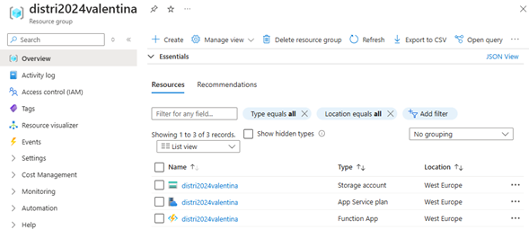
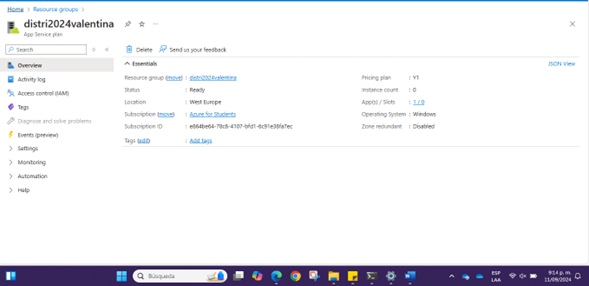
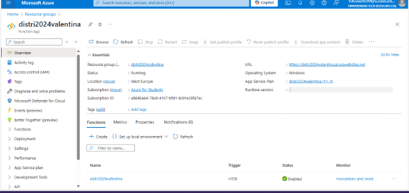
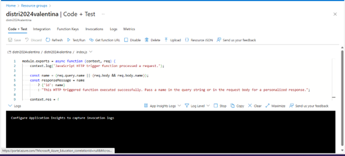
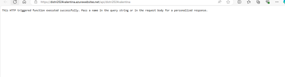

# 🌐 Proyecto de Despliegue en Azure con Terraform

En esta práctica, desplegamos una aplicación web utilizando **Terraform** junto con varios recursos de **Azure**. A continuación, explicamos cada paso de este proceso, desde la creación del grupo de recursos hasta la implementación del código y las pruebas en una Function App.

## 📁 Creación del Resource Group

Lo primero fue crear un **Resource Group** en Azure. Este actúa como contenedor lógico para todos los recursos que se desplegarán en la nube.

```hcl
resource "azurerm_resource_group" "rg" {
  name     = var.name_function
  location = var.location
}
```
Este recurso define la agrupación de los demás componentes en una única ubicación.




---
## ☁️ Creación del Storage Account

Luego, creamos una cuenta de almacenamiento. Este servicio es útil para almacenar datos de diferentes tipos y es esencial para nuestra Function App, ya que requiere un almacenamiento asociado.

```hcl
resource "azurerm_storage_account" "sa" {
  name                     = var.name_function
  resource_group_name      = azurerm_resource_group.rg.name
  location                 = azurerm_resource_group.rg.location
  account_tier             = "Standard"
  account_replication_type = "LRS"
}
```
Este recurso se encargará de almacenar archivos necesarios para la aplicación.


---

## ⚙️ Creación del Service Plan

El siguiente paso fue crear un Service Plan. Este especifica el tipo de servicio que utilizaremos para nuestra Function App. En este caso, seleccionamos un plan de consumo con Windows como sistema operativo.

```hcl
resource "azurerm_service_plan" "sp" {
  name                = var.name_function
  resource_group_name = azurerm_resource_group.rg.name
  location            = azurerm_resource_group.rg.location
  os_type             = "Windows"
  sku_name            = "Y1"
}

```

 

---
## 🚀 Despliegue de la Function App

Ahora desplegamos la Function App, que es la pieza central de nuestra práctica. Esta aplicación alojará el código que se ejecutará bajo demanda cuando se realicen solicitudes HTTP.

```hcl
resource "azurerm_windows_function_app" "wfa" {
  name                = var.name_function
  resource_group_name = azurerm_resource_group.rg.name
  location            = azurerm_resource_group.rg.location

  storage_account_name       = azurerm_storage_account.sa.name
  storage_account_access_key = azurerm_storage_account.sa.primary_access_key
  service_plan_id            = azurerm_service_plan.sp.id

  site_config {
    application_stack {
      node_version = "~18"
    }
  }
}
```

 

---
## 🛠️ Configuración del Código y Pruebas

Finalmente, configuramos el código y las pruebas que se ejecutarán en la Function App. Utilizamos un archivo index.js con código JavaScript para manejar las solicitudes GET y POST.

```hcl
resource "azurerm_function_app_function" "faf" {
  name            = var.name_function
  function_app_id = azurerm_windows_function_app.wfa.id
  language        = "Javascript"
  file {
    name    = "index.js"
    content = file("example/index.js")
  }
  test_data = jsonencode({
    "name" = "Azure"
  })
  config_json = jsonencode({
    "bindings" : [
      {
        "authLevel" : "anonymous",
        "type" : "httpTrigger",
        "direction" : "in",
        "name" : "req",
        "methods" : ["get", "post"]
      },
      {
        "type" : "http",
        "direction" : "out",
        "name" : "res"
      }
    ]
  })
}
```


---
## 🌐 URL de la Function App

Una vez desplegada, la Function App genera una URL que se puede usar para invocar la aplicación. Esto se logra a través del siguiente bloque en el archivo output.tf.

```hcl
output "url" {
  value       = azurerm_function_app_function.faf.invocation_url
  sensitive   = false
  description = "description"
}
```
Esta URL nos permitirá acceder a la aplicación de forma pública.



